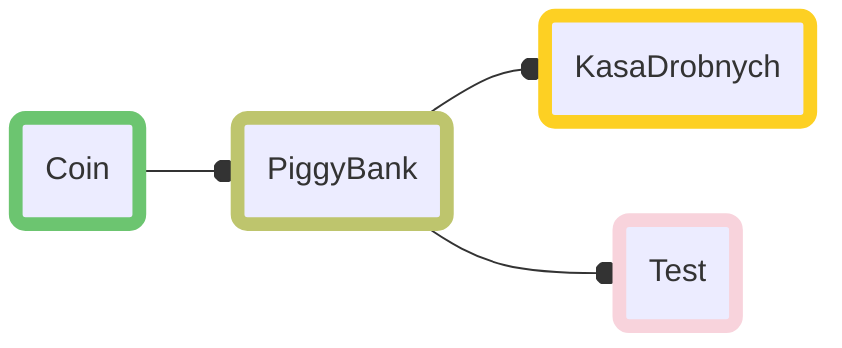

# Java - Zadanie Rekrutacyjne Boldare
##### Java, Programowanie obiektowe, Git

## Dokumentacja
W folderze doc poprzez plik package-summary.html dostępna jest dokumentacja. 

## Diagram klas

## Instalacja i uruchamianie
Pobierz i rozpakuj repozytorium, wejdź do folderu gdzie znajduje się sub-folder src.
Następnie:
`cd src`               
`javac  -d bin  *.java`

By zobaczyć testy:
`java -cp bin Test` 
By uruchomić program:
`java -cp bin KasaDrobnych`

Przykładowy output terminala dla klasy Test i KasaDrobnych znajduje się w odpowiadających plikach log.

